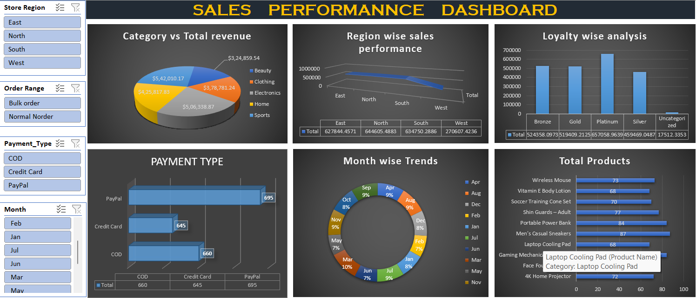

# 📊 E-commerce Sales Performance Analysis

## 🔍 Project Overview

This project analyzes e-commerce sales data to uncover key business insights related to revenue, customer behavior, product performance, and regional trends.

The goal is to transform raw transactional data into actionable insights using Excel-based data analysis and dashboarding techniques.

---

## 🧰 Tools & Techniques Used

* Microsoft Excel
* Pivot Tables
* Data Cleaning & Transformation
* Data Visualization (Charts & Dashboard)

---

## 📁 Dataset Description

The dataset includes:

* Store details (Region, City, Store Type)
* Customer data (Name, Loyalty Level)
* Product information (Category, Product Name)
* Transaction details (Payment Method, Discounts, Total Amount)

---

## 📊 Key Insights

* Electronics is the top-performing category in terms of revenue generation
* South region generates the highest sales, while West underperforms
* Platinum customers contribute the most revenue
* PayPal is the most frequently used payment method
* Sales data is right-skewed, indicating reliance on high-value transactions
* Monthly sales trends show consistent performance with slight peaks

---

## 📈 Dashboard

---

## 🧹 Data Cleaning Process

* Removed inconsistencies in discount values
* Standardized payment methods
* Handled missing values in loyalty categories
* Validated calculated fields (Total Amount)

---

## 🚀 Business Recommendations

* Focus on high-performing categories like Electronics and Sports
* Improve strategy in underperforming regions (West)
* Retain high-value customers (Platinum & Gold tiers)
* Optimize PayPal payment experience
* Target high-value transactions for revenue growth

---

## 📌 Conclusion

This project demonstrates how Excel can be used to perform end-to-end data analysis, from cleaning raw data to building dashboards and generating business insights.
